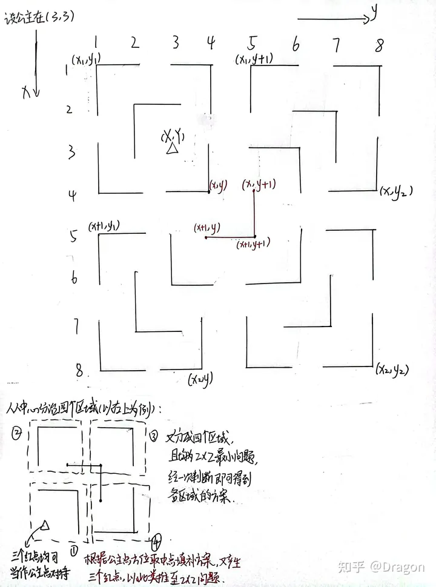

[算法(Algorithm)-分治-洛谷 P1228 地毯填补问题 - 知乎 (zhihu.com)](https://zhuanlan.zhihu.com/p/594534245)



```cpp
//理解版:
#include <cstdio>
int k, n = 1;
#define pf(a, b, id) {printf("%d %d %d\n", a, b, id);}
void dfs(int x1, int y1, int x2, int y2, int X, int Y)
{
    if(x2 - x1 + 1 == 2 && y2 - y1 + 1 == 2)//此时为最小问题 2x2 问题，依据特殊点位置即可输出对应方案
    {
        if(X == x1 && Y == y1) pf(x2, y2, 1);//特殊点位置在左上角，对角使用地毯方案 1
        if(X == x1 && Y == y2) pf(x2, y1, 2);//右上角
        if(X == x2 && Y == y1) pf(x1, y2, 3);//左下角
        if(X == x2 && Y == y2) pf(x1, y1, 4);//右下角
        return;
    }
    int x = ((x2 - x1 + 1) >> 1) + (x1 - 1);//取中点(x, y)分治
    int y = ((y2 - y1 + 1) >> 1) + (y1 - 1);
    //据 公主点\特殊点 (X, Y)的方位分治
    if(X <= x && Y <= y)//公主位于左上区域
    {
        pf(x + 1, y + 1, 1);
        dfs(x1, y1, x, y, X, Y);//左上区域，亦是公主点区域
        //以(x+1, y+1)点的地毯方案，其上三个点分别视作特殊点，继续分治其他三个区域，每个区域都用左上角点与右下角点框选
        dfs(x + 1, y1, x2, y, x + 1, y);//左下区域
        dfs(x + 1, y + 1, x2, y2, x + 1, y + 1);//右下区域
        dfs(x1, y + 1, x, y2, x, y + 1);//右上区域
    }
    if(X <= x && Y > y)//右上
    {
        pf(x + 1, y, 2);
        dfs(x1, y + 1, x, y2, X, Y);//右上区域，公主点区域
        dfs(x1, y1, x, y, x, y);//左上区域
        dfs(x + 1, y1, x2, y, x + 1, y);//左下区域
        dfs(x + 1, y + 1, x2, y2, x + 1, y + 1);//右下区域
    }
    if(X > x && Y <= y)//左下
    {
        pf(x, y + 1, 3);
        dfs(x + 1, y1, x2, y, X, Y);//左下，公主点
        dfs(x1, y1, x, y, x, y);//左上区域
        dfs(x1, y + 1, x, y2, x, y + 1);//右上区域
        dfs(x + 1, y + 1, x2, y2, x + 1, y + 1);//右下区域
    }
    if(X > x && Y > y)//右下
    {
        pf(x, y, 4);
        dfs(x + 1, y + 1, x2, y2, X, Y);//右下，公主点        
        dfs(x1, y1, x, y, x, y);//左上区域
        dfs(x1, y + 1, x, y2, x, y + 1);//右上区域
        dfs(x + 1, y1, x2, y, x + 1, y);//左下区域
    }
}
int main()
{
    int X, Y;
    scanf("%d%d%d", &k, &X, &Y);
    n <<= k;//获取边长
    dfs(1, 1, n, n, X, Y);
    return 0;
}
```