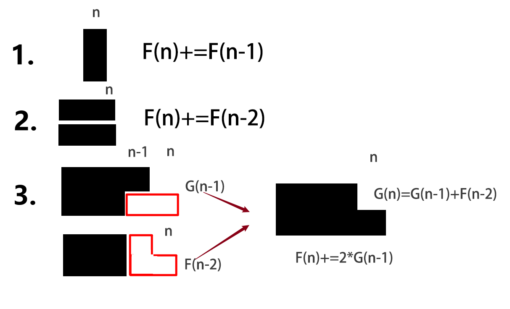

分情况:
$$
\left\{
\begin{aligned}
& 条形 \left\{ \begin{aligned} 
横着\\
竖着\\
\end{aligned}\right. \\
& L形\\
\end{aligned}
\right.
$$

### 条形

设 $ F(n)$ 长度为 $n$ 的方法数

#### 横着

$F(n)+=F(n-1)$ 

#### 竖着

$F(n)+=F(n-2)$ 

### L形

设$G(n)$ 为长度凸出来那一点到 $n$ 的方法数

$G(n)=G(n-1)+F(n-2)$

此为$G$ 的递推公式

## 答案

$F(n)=F(n-1)+F(n-2)+2\times G(n-1)$

此为$F$ 的递推公式

### 初始条件

$$
F(0)=1\\
F(1)=1\\
F(2)=2\\\
 \\
 G(1)=0\\
G(2)=1\\
G(3)=1\\
G(4)=3\\
$$


## 变式


$$
\begin{aligned}
&G(n)-G(n-1)=F(n-2)\\
&G(n-1)-G(n-2)=F(n-3)\\
&\cdots\\
&G(4)-G(3)=F(2)\\
&G(3)-G(2)=F(1)\\
&G(2)-G(1)=F(0)\\
&累加得\\
&G(n)=\sum_{k=0}^{n-2} F(k)+G(1)\\
&G(2)=1\\
&G(n)=\sum_{k=0}^{n-2} F(k)\\
\end{aligned}
$$

所以$F(n)$ 得
$$
\begin{aligned}
&F(n)=F(n-1)+F(n-2)+2\times G(n-1)\\
&带入G(n-1)\\
&得到F(n)=F(i-1)+F(i-2)+2\times\sum_{i=0}^{n-3} F(i)\\

\end{aligned}
$$

```C++
#include<iostream>
using namespace std;
const int N = 1e7+9;
int F[N];
int main() {
	int n; cin >> n;
	int ch = 0;
	F[0] = 1; F[1] = 1; F[2] = 2;
	for (int i = 3; i <= n; i++) {
		ch += F[i - 3];
		ch %= 10000;
		F[i] = F[i - 1] + F[i - 2] + 2 * ch;
		F[i] %= 10000;
	}
	cout << F[n];
	return 0;
}
```

或者改为

```c++
#include<iostream>
using namespace std;
const int N = 1e7 + 9;
int F[N];
int main() {
	int n; cin >> n;
	int ch = 0;
	F[3] = 1;\\表示n=0的时候
	for (int i = 4; i <= n+3; i++) {
		ch += F[i - 3];
		ch %= 10000;
		F[i] = F[i - 1] + F[i - 2] + 2 * ch;
		F[i] %= 10000;
	}
	cout << F[n+3];
	return 0;
}
```


由于只用到了$F(i)$ $F(i-1)$  $F(i-2)$ $F(3)$  

简化为

```C++
#include<iostream>
using namespace std;
int main() {
	int n; cin >> n;
	int ch = 0;
	int a = 0, b = 0, c = 1,ans=0;
	for (int i = 1; i <= n; i++) {
		ch += a;
		ch %= 10000;
		ans = b + c + 2 * ch;
		ans %= 10000;
		a = b;
		b = c;
		c = ans;
	}
	cout << ans;
	return 0;
}
```


$a$ 表示 $F[-2]$

$b$ 表示 $F[-1]$

$c$ 表示 $F[0]$

$ans$ 表示 $F[1]$