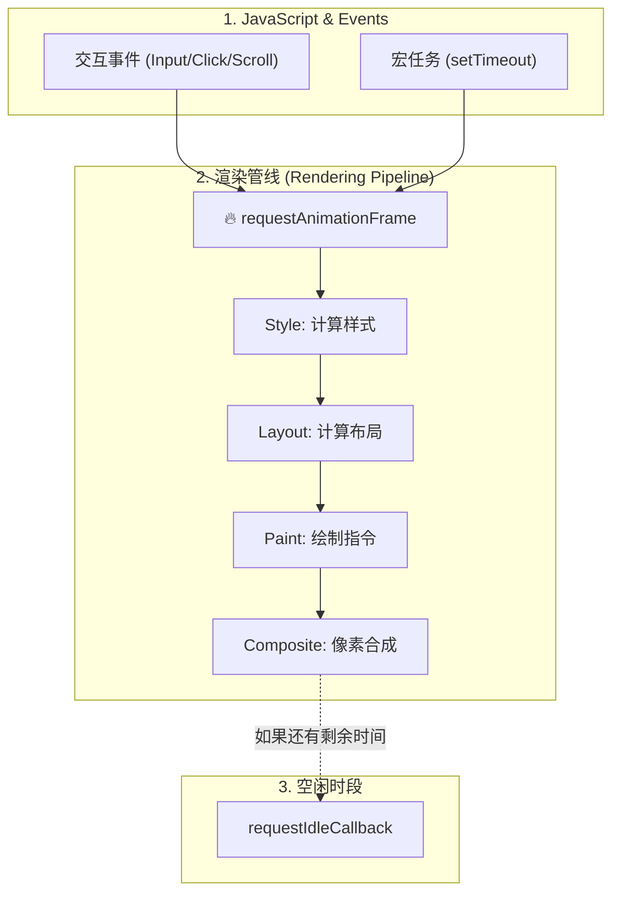

# requestAnimationFrame (rAF) 核心知识点梳理

## 0. 本质透析 (The Essence)

如果要用一句话通过本质来定义 `requestAnimationFrame`，它是：

> **浏览器的“渲染帧”生命周期钩子 (The Rendering Frame Lifecycle Hook)。**

从计算机科学和浏览器内核的角度来看，它的本质包含以下三个层面：

1.  **硬件层：VSync 的软件接口**
    *   显示器通常以固定频率（如 60Hz）刷新。rAF 是浏览器内核暴露给 JavaScript 的、与**垂直同步信号 (VSync)** 对齐的接口。
    *   它不是“定时器”，而是“信号接收器”。浏览器收到 VSync 信号 -> 准备生成新帧 -> 触发 rAF 队列。

2.  **事件循环层：渲染阶段的入口队列**
    *   在 Event Loop 图谱中，rAF 不是宏任务（MacroTask），也不是微任务（MicroTask）。
    *   它是专属的 **UI 渲染阶段 (Rendering Phase)** 的**前置回调队列**。它的执行标志着“纯 JS 计算阶段”的结束，和“像素处理阶段”的开始。
    *   **快照机制 (Queue Snapshot)**：在每一帧开头，浏览器会“锁死”当前已注册的 rAF 队列。
        *   **在当前帧之前注册的**：全部在这一帧执行。
        *   **在回调执行期间新注册的**：放入**下一帧**的队列，绝不会“插队”到当前帧。

3.  **应用层：显示器刷新率的节流阀 (Throttle)**
    *   无论你的代码跑得多快，或者屏幕刷新率是多少（60Hz/144Hz），rAF 强制你的视觉更新逻辑与屏幕的刷新能力完全同步，从而消除**撕裂 (Tearing)** 和 **掉帧 (Jank)**。

---

## 1. 核心机制

### 1.1 执行时机 (深入渲染管线)
`rAF` 的回调执行时机位于**渲染这扇“大门”打开之前的最后一刻**。

你可以把渲染管线想象成一列发往“屏幕显示站”的地铁。rAF 就像是关门前的最后一次广播：“还有没有乘客（DOM 修改）要上车？”

**每一帧的微观流程 (The Anatomy of a Frame)：**

一个完整的帧（Frame）从 VSync 信号开始，通常包含以下步骤：



**关键执行顺序：**
1.  **处理输入事件 (Input Events)**：阻塞主线程的交互事件（点击、触摸）。
2.  **执行 JS (JS Tasks)**：之前排队的 `setTimeout` 或 `MessageChannel`。
3.  **开始一帧 (Begin Frame)**：
    *   **rAF**：执行 `requestAnimationFrame` 回调。
4.  **渲染 (Rendering)**：
    *   **Style**：计算 CSS 样式。
    *   **Layout**：计算几何位置（回流）。
    *   **Paint**：生成绘制指令。
    *   **Composite**：将图层在 GPU 中合成上屏。
5.  **空闲 (Idle)**：如果上述步骤在 16.6ms 内完成，剩余时间执行 `requestIdleCallback`。

*   **帧对齐**：rAF 会紧跟屏幕的刷新频率（通常是 60Hz，即约 16.7ms 一帧）。
*   **黄金窗口**：`rAF` 的回调是**渲染管线的第一个阶段**。它会在 **JavaScript 逻辑（宏/微任务）全部跑完**且浏览器准备好绘制下一帧时执行。最关键的是，它执行完后，浏览器会**立即**进入 Style（计算样式）和 Layout（布局）阶段。
    *   **时序明确**：`System JS Task` -> `Microtasks` -> `rAF Callback` -> `Style` -> `Layout` -> `Paint`。
    *   **同一帧内**：这所有的步骤合起来构成了**完整的一帧**。所以它既是在“当前JS跑完后”，也是在“渲染管线开始前”。
*   **对比 setTimeout**：`setTimeout` 可能会在一个帧的中间（比如第 8ms）执行完，导致此时修改了 DOM，但必须要等到 8ms 后的下一帧才会渲染，甚至可能因为时机不对导致“丢帧”。

### 1.2 自动暂停
*   当页面被隐藏（切到后台标签页）或最小化时，`requestAnimationFrame` 会**自动暂停**。这能极大节省 CPU 和电池寿命。`setTimeout` 则会继续并在后台“空转”。

---

## 2. 标准写法：基于时间的动画 (Time-based)

不要在 rAF 里做简单的 `x += 5`（基于帧的动画），因为不同设备的刷新率不同（60Hz vs 120Hz）。**标准做法是基于时间计算进度**。

```javascript
// 1. 定义总时长
const DURATION = 2000; 
let start = null;

function step(timestamp) {
    if (!start) start = timestamp;
    
    // 2. 计算进度 (0.0 ~ 1.0)
    const elapsed = timestamp - start;
    const progress = Math.min(elapsed / DURATION, 1); // 封顶 1

    // 3. 应用缓动算法 (可选)
    const easedProgress = easeOutExpo(progress);

    // 4. 计算当前值
    const currentValue = startValue + (endValue - startValue) * easedProgress;
    element.style.transform = `translateX(${currentValue}px)`;

    // 5. 判断是否继续
    if (progress < 1) {
        requestAnimationFrame(step);
    } else {
        // 动画结束
    }
}

requestAnimationFrame(step);
```

---

## 3. 常见陷阱与解决方案（你遇到的问题）

### 3.1 作用域陷阱与“并发打架”
这是你在 `priceUp.html` 中遇到的核心问题。

*   **现象**：快速点击按钮多次，每次点击都创建了一个由于**这一帧内**并发执行的 `requestAnimationFrame` 循环。
*   **原因**：每次函数执行创建了新的**闭包作用域**，旧的 `rafId` 存在于旧的作用域中，无法被新的点击事件访问和取消。
*   **后果**：多个 Loop 同时修改同一个 DOM，导致数值跳变、抖动。
*   **解决**：
    *   **策略 A (单例模式)**：将 `cancel` 函数的控制权提升到外部作用域（变量提升）。开始新动画前，强制调用上一个动画的 cancel。
    *   **策略 B (队列模式)**：逻辑上排队。只有当前没有动画在跑（`isAnimating = false`）才启动下一个。

### 3.2 内存泄漏误区
*   **误区**：“如果不 cancel，它会一直跑吗？”
*   **事实**：rAF 是一次性的。如果你在回调函数内部如果不再次调用 `requestAnimationFrame`，循环自然就断了。
*   **GC**：只要没有变量引用这个回调，且它没被注册到浏览器的下一帧队列中，JS 垃圾回收机制会自动回收内存。

---

## 4. requestAnimationFrame vs setTimeout/setInterval

| 特性 | requestAnimationFrame | setTimeout |
| :--- | :--- | :--- |
| **触发频率** | 既然由系统决定 (通常 60Hz) | 手动设定 (如 16ms) |
| **精准度** | 高，与垂直同步信号 (VSync) 对齐 | 低，易受主线程阻塞影响 |
| **后台运行** | 自动暂停 (省电) | 继续运行 (变慢) |
| **适用场景** | 视觉动画、Canvas 绘制、DOM 变更 | 逻辑定时器、轮询接口 |

---

## 5. 高级技巧：取消动画 (Cancel)

`cancelAnimationFrame` 用于取消一个**尚未执行**的帧请求。

```javascript
// 启动
const rafId = requestAnimationFrame(loop);

// 取消 (必须拿到 id)
cancelAnimationFrame(rafId);
```
**注意**：如果回调函数已经开始执行（正在 `frame` 函数内部），`cancelAnimationFrame` 无法中断当前的同步代码执行，它只能取消“下一帧”的预约。

## 6. 面试/实战高频考点

1.  **Q: 能够在一个 `requestAnimationFrame` 里处理 1000 个 DOM 更新吗？**
    *   **A:** 可以，但不明智。浏览器虽然会把多次 DOM 写操作合并（Layout Thrashing 优化），但 JS 执行时间过长（超过 16ms）会导致掉帧（Jank）。应当使用 `DocumentFragment` 或分批处理。

2.  **Q: 为什么 rAF 的回调里有 `timestamp` 参数？**
    *   **A:** 这是一个高精度时间戳（`performance.now()`），表示**当前帧开始渲染的时间点**。同一帧里所有 rAF 回调收到的 `timestamp` 都是完全一样的，这保证了同一帧内的多个动画能够严格同步。
