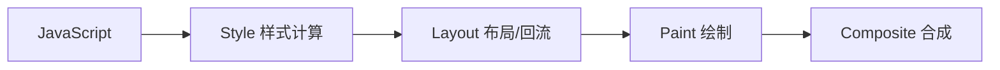

# 浏览器渲染管线 (Rendering Pipeline) 深度解析

浏览器的渲染管线是指从 HTML/CSS 代码到屏幕上显示出像素的整个过程。理解这个流程对于性能优化（特别是避免掉帧）至关重要。

我们通常关注的“像素管道”（Pixel Pipeline）主要包含以下 5 个关键阶段：



---

## 1. 五大核心阶段

### 1.1 JavaScript (触发)
这是动画或视觉变化的起点。
*   **内容**：JS 修改 DOM、修改 CSS 样式、CSS 动画、Web Animations API 等。
*   **优化点**：
    *   使用 `requestAnimationFrame` 对齐帧率。
    *   避免长时间运行的 JS 阻塞主线程。

### 1.2 Style (样式计算)
浏览器需要计算出每个元素匹配哪些 CSS 规则，并最终确定每个元素的具体样式。

*   **输入**：DOM 树 + CSS 规则 (CSSOM)。
*   **输出**：Render Tree (渲染树) 的样式部分（每个节点都知道自己是红色、block 布局等）。
*   **触发时机**：
    1.  **DOM 结构改变**：添加/删除节点。
    2.  **class 属性改变**：`el.classList.add('active')`。
    3.  **style 属性改变**：`el.style.color = 'red'`。
    4.  **强制同步布局时**：当 JS 读取布局属性时，浏览器必须先完成 Style 计算，才能做 Layout。
*   **优化点**：降低选择器的复杂度（虽然现代浏览器优化得很好，但过于深层嵌套仍有代价）。

### 1.3 Layout (布局 / 回流 Reflow)
浏览器计算元素在屏幕上的**几何信息**（位置、大小）。
*   **关键点**：布局是流动的。一个元素的改变（例如 `width` 变大）可能会推挤周围的元素，甚至导致整个文档重新布局。
*   **高频触发属性**：`width`, `height`, `margin`, `padding`, `top`, `left`, `fontSize` 等。
*   **优化点**：尽量减少触发布局的属性修改。

### 1.4 Paint (绘制 / 重绘 Repaint)
浏览器填充像素的过程。包括绘制文本、颜色、图像、边框、阴影等。
*   **机制**：绘制通常是在多个“图层”（Layers）上进行的。
*   **高频触发属性**：`color`, `background`, `box-shadow`, `border-radius` 等。
*   **优化点**：Paint 操作非常消耗性能（虽然比 Layout 轻一点，但像素量大时依然慢）。

### 1.5 Composite (合成)
浏览器将所有绘制好的图层（Layers）按照正确的顺序叠加在一起，显示到屏幕上。
*   **关键点**：这一步通常由 **GPU** 负责，非常快。
*   **黄金属性**：**`transform`** 和 **`opacity`**。
    *   修改这两个属性只会触发 Composite，**完全跳过 Layout 和 Paint 阶段**。
*   **优化点**：做动画时，尽量只改变 `transform` 和 `opacity`。

---

## 2. 性能优化的三种模式

不同的 CSS 修改会触发管道中不同长度的流程。路径越短，性能越好。

### 模式 A：最昂贵 (JS -> Layout -> Paint -> Composite)
> **修改了元素的几何属性（如 `width`, `margin`, `left`）**

*   浏览器必须重新计算布局（Reflow）。
*   布局变了，必须重新绘制像素（Repaint）。
*   最后再合成。
*   **后果**：如果在动画中这样写，很容易导致掉帧（Jank）。

### 模式 B：中等开销 (JS -> Paint -> Composite)
> **修改了绘制属性（如 `background-color`, `color`, `box-shadow`）**

*   布局（大小位置）没变，所以**跳过 Layout**。
*   但颜色变了，必须重新绘制。
*   **后果**：比模式 A 快，但对于移动端的大面积绘制依然有压力。

### 模式 C：性能最佳 (JS -> Composite)
> **修改了合成属性（`transform`, `opacity`）**

*   **跳过 Layout**。
*   **跳过 Paint**。
*   直接在 GPU 层面操作图层合成。
*   **后果**：极度流畅，丝般顺滑。这也是为什么推荐用 `transform: translateX(100px)` 代替 `left: 100px` 做位移动画的原因。

---

## 3. 强制同步布局 (Forced Synchronous Layout)

这是开发者最容易犯的错误，导致 Layout 阶段耗时暴增。

**错误示范（读写交替）：**
```javascript
const div = document.getElementById('box');

// 1. 写：修改了样式，浏览器标记为“待更新”
div.style.width = '100px';

// 2. 读：请求几何信息
// 浏览器被迫【立即】运行 Layout 流程算出结果给 JS，而不是等这一帧结束
const width = div.offsetWidth; 

// 3. 写
div.style.width = width + 1 + 'px';
```

**正确示范（读写分离）：**
```javascript
// 1. 先全读
const width = div.offsetWidth; 

// 2. 再全写
div.style.width = (width + 1) + 'px';
```

---

## 4. 总结指南

| 优化目标 | 策略 | 关键词 |
| :--- | :--- | :--- |
| **JS** | 避免主线程阻塞，使用 rAF 调度 | `requestAnimationFrame` |
| **Style** | 降低选择器复杂度 | BEM 命名法, 浅层级 |
| **Layout** | 避免修改几何属性，读写分离 | `transform`, `offsetWidth` |
| **Paint** | 减少重绘区域，提升图层 | `will-change`, `z-index` |
| **Composite** | 坚持使用合成属性做动画 | **`transform`, `opacity`** |
