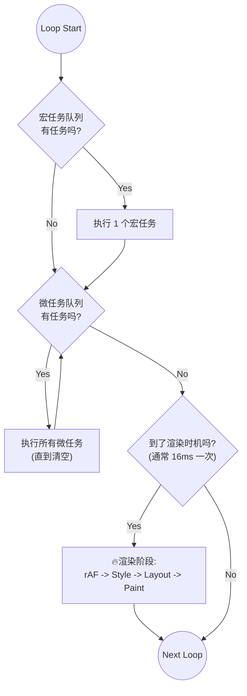

# JavaScript 执行机制与事件循环 (Event Loop) 深度解析

**事件循环 (Event Loop)** 是浏览器协调 JavaScript 执行、事件处理、UI 渲染、网络请求等任务的核心机制。

---

## 1. 为什么需要 Event Loop？

JavaScript 是 **单线程 (Single Threaded)** 的。这意味着它同一时间只能做一件事。
为了防止主线程被耗时的操作（如网络请求、定时器等待）永远卡死，浏览器采用了一种 **“非阻塞” (Non-blocking)** 的机制：

*   **同步代码**：立即在主线程执行。
*   **异步操作**：交给浏览器的其他线程（如网络线程、定时器线程）去处理，处理完后把回调函数扔进**队列**里。
*   **Event Loop**：主线程闲下来时，就像一个永不休息的巡检员，去队列里取任务出来执行。

---

## 2. 宏任务 (MacroTasks) 与 微任务 (MicroTasks)

在 Event Loop 中，任务队列分为两种，优先级完全不同：

| 特性 | **宏任务 (Macrotask)** | **微任务 (Microtask)** |
| :--- | :--- | :--- |
| **代表** | `script`(整体代码), `setTimeout`, `setInterval`, `UI交互`, `I/O` | `Promise.then`, `MutationObserver`, `queueMicrotask` |
| **优先级** | 低 | **极高** (插队执行) |
| **执行时机** | 每次 Loop 取**一个**执行 | 每一个宏任务结束后，**清空所有**微任务 |

### 🚨 核心规则：微任务霸权
> **只要微任务队列不为空，主线程就绝不会去执行下一个宏任务，也绝不会去渲染 UI。**

---

## 3. Event Loop 的标准流程 (循环圈)

浏览器的一轮循环 (Tick) 通常遵循以下步骤：



1.  **取宏任务**：从宏任务队列取**一个**最早的任务执行。
2.  **清微任务**：检查并清空微任务队列。
3.  **尝试渲染** (Rendering Opportunity)：
    *   **时机**：通常每秒 60 次（跟随屏幕刷新率 VSync）。这意味着在两次渲染之间，可能会执行多次宏任务 (Event Loop) 循环。
    *   **requestAnimationFrame**：**它是渲染阶段的第一步**（不属于宏任务也不属于微任务队列）。
    *   **流程**：`rAF回调` -> `Style` (计算样式) -> `Layout` (布局) -> `Paint` (绘制)。
    *   *说明：如果这一轮 Loop 不需要渲染，这一步会被直接跳过。*
4.  **循环**：回到第 1 步。

### 🔁 关键点：Loop 转得快，Render 动得慢

你总结得非常对：**“一帧之内会执行多次 Event Loop，但只渲染一次。”**

*   **Loop (Tick)**：非常快。只要主线程空闲，它就会不断地取任务。比如处理鼠标移动、数据计算、Timer 回调。16ms 内可能跑了 50 个 Loop。
*   **Render**：有节制。通常锁定在 60Hz (16.6ms)。
    *   在大多数 Loop 中，`RenderCheck` 的结果都是 **No**（还没到时间，或者没必要画）。
    *   只有在 **VSync 信号** 到来时的那一次 Loop，`RenderCheck` 才会变为 **Yes**，此时才会执行 `rAF` 和绘制。

---

## 4. 经典案例分析：阻塞渲染

回顾你的代码案例：

```javascript
// 1. 这是一个宏任务 (Script)
console.log('Script Start');

setTimeout(() => {
    // 4. 下一个宏任务
    console.log('Timeout'); 
}, 0);

Promise.resolve().then(() => {
    // 3. 微任务 (插队!)
    console.log('Promise'); 
});

// 2. 同步代码阻塞
for (let i = 0; i < 10000000; i++) { /* 占着 CPU 不放 */ }

console.log('Script End');
// -> 此时才会去检查微任务队列
// -> 此时才会去尝试渲染 (如果有 DOM 变更)
```

**执行顺序：**
1.  `Script Start`
2.  `Script End` (尽管中间有个大循环，主线程必须跑完当前宏任务)
3.  `Promise` (宏任务跑完了，立马看微任务)
4.  `Timeout` (微任务清空了，渲染也检查过了，下一轮 Loop 取出的宏任务)

---

## 5. 常见误区纠正

1.  **误区**：`setTimeout(fn, 0)` 是立即执行。
    *   **真相**：它是“尽可能快”地放入宏任务队列。如果主线程正在忙（比如在跑这一行代码的后续部分，或者在跑微任务），它必须排队。
    
2.  **误区**：微任务会在渲染之后执行。
    *   **真相**：**微任务一定在渲染之前**。如果你在 `.then()` 里写了死循环，浏览器就永远无法渲染，页面会直接卡死。

3.  **误区**：Event Loop 是 JS 引擎的一部分。
    *   **真相**：Event Loop 是**浏览器环境 (Host Environment)** 提供的机制，用来调度 JS 引擎。JS 引擎只管执行栈里的代码。

---

## 6. 特殊场景：mousemove / scroll 是什么时候执行？

**直接答案**：它们属于 **宏任务 (MacroTask)**，通过操作系统的硬件中断触发。

鼠标移动得越快，产生的宏任务就越多。

### 6.1 "浪费每一次心跳" (Oversampling)
假设你的屏幕是 60Hz (16.6ms 一帧)，但你的鼠标汇报率是 1000Hz (电竞鼠标，1ms 一次)。

**一帧内的实际情况可能是这样的：**

1.  **0ms**: Event Loop 取出 `mousemove` 宏任务 #1 -> **执行 JS** (修改位置 top: 1px) -> Check Render (No)
2.  **1ms**: Event Loop 取出 `mousemove` 宏任务 #2 -> **执行 JS** (修改位置 top: 2px) -> Check Render (No)
3.  **2ms**: Event Loop 取出 `mousemove` 宏任务 #3 -> **执行 JS** (修改位置 top: 3px) -> Check Render (No)
    ... (中间重复了一堆这种无效操作) ...
4.  **16.6ms**: **VSync 信号到来**。
    *   JS 暂停。
    *   **Style 计算**：浏览器只看 DOM 的**当前状态** (即 top: 50px)。中间设置的 1px...49px 全部被忽略了，白算了。
    *   **Paint**：屏幕上画出位置 50px。

> **结论**：如果不加控制，`mousemove` 的回调在每一帧内可能会执行多次（宏任务），导致 JS 线程过载，但用户只能看到最后一次修改的结果。

### 6.2 最佳实践：rAF 节流
不要在 `mousemove` 里直接写重逻辑或操作 DOM。应该把它拆开：

```javascript
let currentX = 0;

// 【动作】只负责记录最新的数据 (跑得飞快)
window.addEventListener('mousemove', e => {
    currentX = e.clientX; 
});

// 【渲染】只在每一帧负责画一次 (跑得精准)
function render() {
    box.style.transform = `translateX(${currentX}px)`;
    requestAnimationFrame(render);
}
requestAnimationFrame(render);
```
