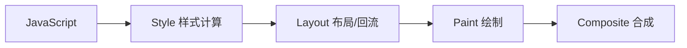
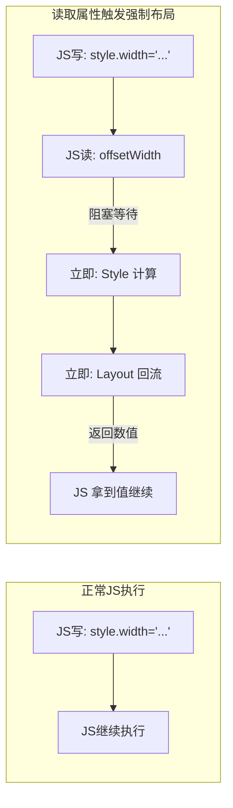

# 强制重绘 (Forced Reflow) 技术指南



## 1. 什么是强制重绘？

**强制重绘**（也称强制同步布局，Forced Synchronous Layout）是指通过 JavaScript 代码并在浏览器渲染流程的特定时刻，迫使浏览器立即重新计算元素的布局（Layout）和样式（Style），而不是等待当前的 JavaScript 执行栈结束。

### 核心原理

通常情况下，浏览器会有一个**渲染队列**机制。当你用 JS 修改样式（`style.width = ...`）时，浏览器并不会立刻去画，而是把这个操作存起来，等待 JS 跑完或者达到一定时间阈值，再批量执行，以节省性能。

但是，当你通过 JS **读取**某些布局属性（如 `offsetHeight`）时，浏览器为了给你返回最新的、正确的值，不得不打断当前的等待，立即把队列里所有的样式修改都应用上，并重新计算布局。这个过程就是“强制重绘”。

#### 渲染流程图解



## 2. 为什么在 CSS 动画中非常重要？

在处理 CSS `transition`（过渡）或 `animation`（动画）时，浏览器的批量优化机制有时会“帮倒忙”。

**经典场景：从 `display: none` 到淡入显示**

```javascript
// 错误写法
el.style.display = 'block'; // 1. 放入队列
el.classList.add('active'); // 2. 放入队列 (active 包含 opacity: 1)

// 浏览器的实际执行：
// 发现你需要变成 display: block 且 opacity: 1。
// 直接一步到位渲染最终结果。
// 结果：元素直接出现，没有过渡动画。
```

**解决方案：插入强制重绘**

```javascript
// 正确写法
el.style.display = 'block';

// ! 关键点：读取属性，强迫浏览器先完成 display: block 的渲染
el.offsetHeight; 

el.classList.add('active'); 

// 浏览器的实际执行：
// 1. 先渲染 display: block (opacity 此时还是 0)
// 2. 下一帧检测到 opacity 变为 1
// 3. 触发 transition 动画
```

## 3. 如何触发强制重绘？

只要在 JS 中读取以下任意一个 DOM 属性，都会触发回流（Reflow）：

**常用盒模型属性：**

* `elem.offsetLeft`, `elem.offsetTop`
* `elem.offsetWidth`, `elem.offsetHeight`
* `elem.offsetParent`
* `elem.clientLeft`, `elem.clientTop`
* `elem.clientWidth`, `elem.clientHeight`
* `elem.scrollWidth`, `elem.scrollHeight`
* `elem.scrollTop`, `elem.scrollLeft`

**样式计算方法：**

* `window.getComputedStyle(elem)`
* `window.getComputedStyle(elem).getPropertyValue('...')`

**通常用法：**
为了代码可读性，通常会写成这样，并加上注释防止被误删：

```javascript
void el.offsetWidth; // 触发重绘
```

## 4. 常见应用场景

除了解决 display 切换动画，它还有很多用途：

### 场景 A：重启动画 (Replay Animation)

CSS Animation 通常只在类名添加时播放一次。如果你想让按钮被点击多次就晃动多次，必须先移除类，强制重绘，再添加类。

```javascript
function replayAnimation(element, className) {
    element.classList.remove(className);
  
    // 必须强制重绘，否则浏览器会认为类名根本没变过
    void element.offsetWidth; 
  
    element.classList.add(className);
}
```

### 场景 B：新创建元素的入场动画

新 `append` 进 DOM 的元素，如果想立即执行 CSS transition 滑入，也需要强制重绘。

```javascript
const box = document.createElement('div');
box.className = 'box'; // 初始状态 transform: translateX(-100%)
document.body.appendChild(box);

// 强制确定初始位置
box.offsetHeight;

box.classList.add('enter'); // 目标状态 transform: translateX(0)
```

### 场景 C：Height: 0 到 Height: Auto 的过渡

CSS transition 不支持通过 height 属性平滑过渡到 `auto`。必须使用 JS 计算真实高度。

```javascript
// 1. 先设为 auto 获取真实高度，此时元素是瞬间展开的
el.style.height = 'auto';
const targetHeight = el.scrollHeight;

// 2. 立即把高度设回 0 (利用 JS 执行的原子性，这一步还没有渲染到屏幕)
el.style.height = '0px';

// 3. 强制重绘，确保浏览器“知道”现在是 0px
el.offsetHeight;

// 4. 设定为目标各度，触发 transition
el.style.height = targetHeight + 'px';
```

## 5. 性能警告

虽然强制重绘很好用，但它也很昂贵。频繁地在一帧内触发（例如在循环里读取 offsetHeight），会导致严重的性能瓶颈（布局抖动 Layout Thrashing）。

**Bad Practice:**

```javascript
// 千万不要在循环里这样做！
for (let i = 0; i < len; i++) {
    items[i].style.width = '10px';
    console.log(items[i].offsetWidth); // 每一次循环都触发一次重排！
}
```

## 6. 替代方案：Double requestAnimationFrame

在现代前端开发中，使用双层 `requestAnimationFrame` 是比强制重绘更优雅、性能更好的选择。它可以避免同步计算带来的卡顿风险。

**实现原理：**

1. **第一层 rAF**：确保代码在下一帧的**开始**执行（此时上一帧的样式变更已提交）。
2. **第二层 rAF**：确保上一帧已经完成**绘制**。此时再添加 active 类，浏览器就有了一个明确的“起点帧”和“终点帧”，从而能够平滑过渡。

**代码对比：**

```javascript
// 方案 A：强制重绘 (同步)
el.style.display = 'block';
void el.offsetHeight;
el.classList.add('active');

// 方案 B：Double rAF (异步，推荐)
el.style.display = 'block';
requestAnimationFrame(() => {
    requestAnimationFrame(() => {
        el.classList.add('active');
    });
});
```

**选择建议：**

- 如果需要代码极简，且没有大量 DOM 操：用 **强制重绘**。
- 如果追求极致性能，或者在大规模动画场景：用 **Double rAF**。
